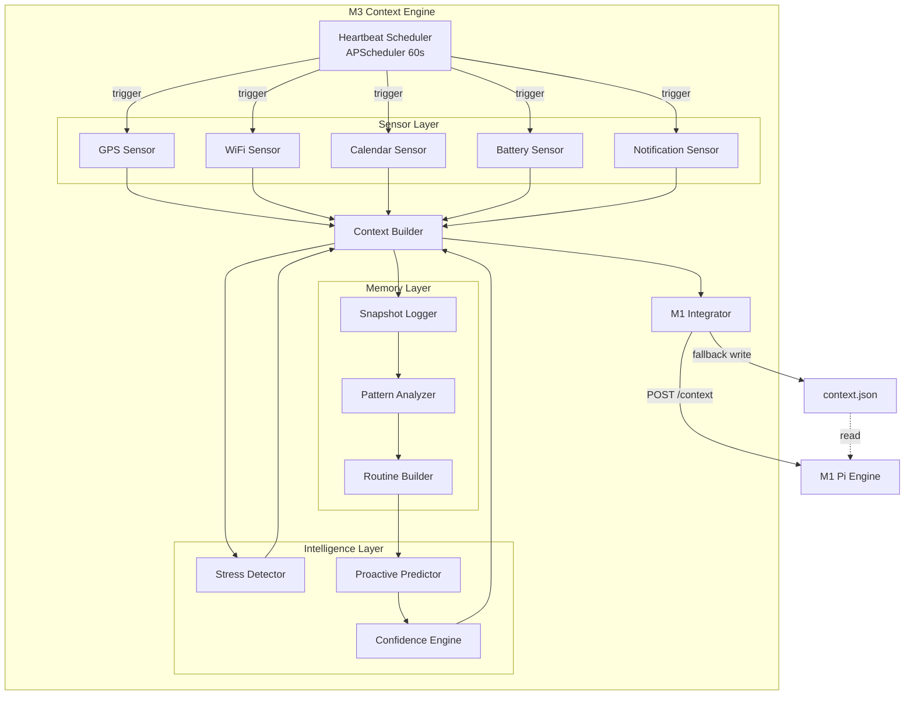
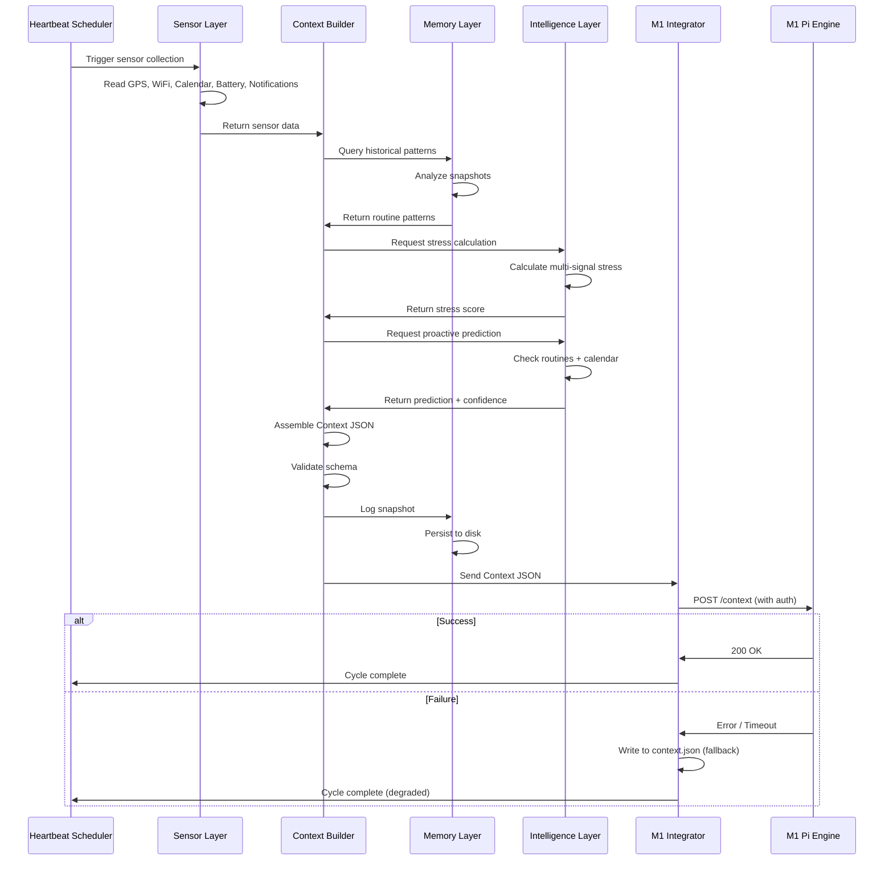

# Design Document: M3 Context Engine

## Overview

The M3 Context Engine is an intelligent context-sensing and prediction system that serves as the environmental awareness layer for the PrismOpenClaw Phantom Mode system. M3 operates as a pure data provider—it gathers sensor data, analyzes patterns, predicts future context transitions, and delivers unified context information to M1 (Pi Engine) every 60 seconds via REST API or file-based integration.

### Core Responsibilities

1. **Sensor Data Collection**: Gather real-time data from GPS, WiFi, calendar, battery, and notification sensors
2. **Context Classification**: Map raw sensor data to meaningful context labels (location, activity, stress level)
3. **Pattern Learning**: Analyze historical data to detect routine patterns and behavioral sequences
4. **Proactive Prediction**: Predict context transitions 15 minutes before they occur
5. **M1 Integration**: Deliver standardized Context JSON to M1 Pi Engine for decision-making

### Design Principles

- **Modular Architecture**: Each layer (Sensor, Memory, Intelligence, Integration) is independently testable
- **Graceful Degradation**: System continues operating with reduced functionality when modules fail
- **Simulation-First**: All hardware-dependent sensors have realistic simulation fallbacks for demo purposes
- **M1 Contract Compliance**: Output format strictly adheres to M1's integration specification
- **Production Quality**: Type hints, comprehensive error handling, PEP 8 compliance, structured logging


## Architecture

### High-Level System Architecture



### Layer Responsibilities

#### 1. Heartbeat Scheduler Layer
- **Purpose**: Orchestrate 60-second update cycles
- **Technology**: APScheduler with IntervalTrigger
- **Responsibilities**:
  - Trigger sensor collection every 60 seconds
  - Coordinate data flow through all layers
  - Handle cycle timing and overlap detection
  - Provide lifecycle management (start, stop, status)

#### 2. Sensor Layer
- **Purpose**: Collect raw environmental data
- **Modules**:
  - `gps_sensor.py`: GPS coordinates → location mapping
  - `wifi_sensor.py`: WiFi SSID → location mapping
  - `calendar_sensor.py`: Calendar API → event extraction
  - `battery_sensor.py`: Device battery level reading
  - `notification_sensor.py`: Unread notification counting
- **Responsibilities**:
  - Abstract hardware access behind clean interfaces
  - Provide simulation fallbacks for demo mode
  - Handle sensor failures gracefully
  - Return normalized, typed data

#### 3. Memory Layer
- **Purpose**: Store and analyze historical context data
- **Modules**:
  - `snapshot_logger.py`: Persist context snapshots to disk
  - `pattern_analyzer.py`: Detect recurring patterns in history
  - `routine_builder.py`: Build routine models from patterns
- **Responsibilities**:
  - Log complete context snapshots every 60 seconds
  - Maintain 7+ days of historical data
  - Query snapshots by time range
  - Detect patterns with 3+ repetitions
  - Calculate pattern strength and confidence

#### 4. Intelligence Layer
- **Purpose**: Analyze context and predict transitions
- **Modules**:
  - `stress_detector.py`: Multi-signal stress calculation
  - `proactive_predictor.py`: 15-minute advance predictions
  - `confidence_engine.py`: Prediction confidence scoring
- **Responsibilities**:
  - Calculate stress score (0.0-1.0) from multiple signals
  - Predict next context 15 minutes before transition
  - Assign confidence scores to predictions
  - Use routine patterns to inform predictions

#### 5. Context Builder Layer
- **Purpose**: Assemble unified Context JSON
- **Module**: `context_builder.py`
- **Responsibilities**:
  - Collect data from all sensors
  - Incorporate intelligence layer outputs
  - Validate against M1 schema
  - Generate standardized Context JSON

#### 6. Integration Layer
- **Purpose**: Deliver context to M1 Pi Engine
- **Module**: `m1_integrator.py`
- **Responsibilities**:
  - POST Context JSON to M1 REST endpoint
  - Handle authentication with Bearer token
  - Implement fallback to file-based integration
  - Track transmission success/failure metrics
  - Retry logic for transient failures

### Data Flow Sequence



### Module Dependency Graph

```
main.py
  └── heartbeat_scheduler.py
        ├── context_builder.py
        │     ├── sensors/
        │     │     ├── gps_sensor.py
        │     │     ├── wifi_sensor.py
        │     │     ├── calendar_sensor.py
        │     │     ├── battery_sensor.py
        │     │     └── notification_sensor.py
        │     ├── memory/
        │     │     ├── snapshot_logger.py
        │     │     ├── pattern_analyzer.py
        │     │     └── routine_builder.py
        │     └── predictors/
        │           ├── stress_detector.py
        │           ├── proactive_predictor.py
        │           └── confidence_engine.py
        └── m1_integrator.py
              └── utils/
                    ├── time_utils.py
                    └── geofence_utils.py
```


## Components and Interfaces

### 1. Heartbeat Scheduler

**File**: `src/engine/heartbeat_scheduler.py`

**Interface**:
```python
class HeartbeatScheduler:
    """Orchestrates 60-second context update cycles using APScheduler."""
    
    def __init__(self, interval_seconds: int = 60):
        """Initialize scheduler with configurable interval."""
        
    def start(self) -> None:
        """Start the heartbeat scheduler."""
        
    def stop(self) -> None:
        """Stop the heartbeat scheduler gracefully."""
        
    def get_status(self) -> Dict[str, Any]:
        """Return current scheduler status and metrics."""
        
    def _execute_cycle(self) -> None:
        """Execute one complete context update cycle (internal)."""
```

**Responsibilities**:
- Use APScheduler's `BackgroundScheduler` with `IntervalTrigger`
- Call `context_builder.build_context()` every 60 seconds
- Pass result to `m1_integrator.send_context()`
- Log cycle start, duration, and completion
- Track cycle count and error count
- Handle long-running cycles (>60s) with warnings

**Configuration**:
- `HEARTBEAT_INTERVAL`: Environment variable (default 60)
- Graceful shutdown on SIGTERM/SIGINT

---

### 2. Sensor Layer Modules

#### GPS Sensor

**File**: `src/sensors/gps_sensor.py`

**Interface**:
```python
class GPSSensor:
    """Collects GPS coordinates and maps to named locations."""
    
    def __init__(self, simulation_mode: bool = False):
        """Initialize GPS sensor with optional simulation."""
        
    def get_coordinates(self) -> Tuple[float, float]:
        """Return current (latitude, longitude) coordinates."""
        
    def get_location(self) -> str:
        """Return named location based on geofence mapping."""
```

**Simulation Strategy**:
- Generate realistic daily routine coordinates:
  - 7:00-9:00 AM: Home → Office (gradual transition)
  - 9:00-12:00 PM: Office
  - 12:00-1:00 PM: Nearby restaurant (lunch)
  - 1:00-5:00 PM: Office
  - 5:00-6:00 PM: Office → Gym
  - 6:00-7:00 PM: Gym
  - 7:00-11:00 PM: Gym → Home
- Use sinusoidal interpolation for smooth transitions
- Add small random jitter (±0.001 degrees) for realism

**Geofence Mapping**:
```python
GEOFENCES = {
    "home": {"lat": 37.7749, "lon": -122.4194, "radius_m": 100},
    "office": {"lat": 37.7849, "lon": -122.4094, "radius_m": 150},
    "gym": {"lat": 37.7649, "lon": -122.4294, "radius_m": 80},
    "college": {"lat": 37.7949, "lon": -122.3994, "radius_m": 200},
}
```

#### WiFi Sensor

**File**: `src/sensors/wifi_sensor.py`

**Interface**:
```python
class WiFiSensor:
    """Collects WiFi SSID and maps to named locations."""
    
    def __init__(self, simulation_mode: bool = False):
        """Initialize WiFi sensor with optional simulation."""
        
    def get_ssid(self) -> Optional[str]:
        """Return current WiFi SSID or None if not connected."""
        
    def get_location(self) -> str:
        """Return named location based on SSID mapping."""
```

**SSID Mapping**:
```python
SSID_TO_LOCATION = {
    "HomeNetwork_5G": "home",
    "OfficeWiFi": "office",
    "GymGuest": "gym",
    "CollegeNet": "college",
    "Starbucks": "cafe",
}
```

**Simulation Strategy**:
- Sync with GPS sensor's simulated location
- Return corresponding SSID for current location
- Occasionally return None (10% probability) to simulate disconnection

#### Calendar Sensor

**File**: `src/sensors/calendar_sensor.py`

**Interface**:
```python
class CalendarSensor:
    """Retrieves calendar events from Google Calendar API or simulation."""
    
    def __init__(self, simulation_mode: bool = False):
        """Initialize calendar sensor with optional simulation."""
        
    def get_current_event(self) -> Optional[Dict[str, Any]]:
        """Return currently active event or None."""
        
    def get_upcoming_event(self) -> Optional[Dict[str, Any]]:
        """Return next upcoming event or None."""
        
    def get_time_to_event(self, event: Dict[str, Any]) -> int:
        """Calculate minutes until event starts."""
```

**Event Schema**:
```python
{
    "title": str,           # "Daily Standup"
    "start_time": datetime, # ISO 8601 timestamp
    "end_time": datetime,   # ISO 8601 timestamp
    "location": str,        # "Office Conference Room"
    "type": str,            # "meeting", "workout", "class", "personal"
}
```

**Simulation Strategy**:
- Generate realistic daily schedule:
  - 9:00 AM: "Daily Standup" (meeting, 15 min)
  - 10:00 AM: "Project Review" (meeting, 60 min)
  - 12:00 PM: "Lunch Break" (personal, 60 min)
  - 2:00 PM: "Deep Work Block" (focus, 120 min)
  - 6:00 PM: "Gym Session" (workout, 60 min)
- Vary schedule by day of week
- Include back-to-back meetings on some days (stress trigger)

#### Battery Sensor

**File**: `src/sensors/battery_sensor.py`

**Interface**:
```python
class BatterySensor:
    """Reads device battery level."""
    
    def __init__(self, simulation_mode: bool = False):
        """Initialize battery sensor with optional simulation."""
        
    def get_battery_level(self) -> int:
        """Return battery percentage (0-100)."""
```

**Simulation Strategy**:
- Start at 100% at 7:00 AM
- Drain at realistic rate: ~5% per hour during active use
- Drain faster during "gym" context (GPS active): ~8% per hour
- Charge when at "home" and after 10:00 PM: +20% per hour
- Add random fluctuations (±2%)

#### Notification Sensor

**File**: `src/sensors/notification_sensor.py`

**Interface**:
```python
class NotificationSensor:
    """Counts unread notifications."""
    
    def __init__(self, simulation_mode: bool = False):
        """Initialize notification sensor with optional simulation."""
        
    def get_notification_count(self) -> int:
        """Return count of unread notifications (0-999)."""
```

**Simulation Strategy**:
- Base rate: 1-3 notifications per hour
- Spike during work hours (9 AM - 5 PM): 5-10 per hour
- Spike before meetings: +5 notifications 10 minutes before
- Drop to 0 during "sleep" context
- Gradual accumulation with occasional clears

---

### 3. Memory Layer Modules

#### Snapshot Logger

**File**: `src/memory/snapshot_logger.py`

**Interface**:
```python
class SnapshotLogger:
    """Persists context snapshots to disk for historical analysis."""
    
    def __init__(self, storage_path: str = "./memory/snapshots.json"):
        """Initialize logger with storage path."""
        
    def log_snapshot(self, context: Dict[str, Any]) -> None:
        """Append context snapshot with timestamp."""
        
    def get_snapshots(self, start_time: datetime, end_time: datetime) -> List[Dict[str, Any]]:
        """Query snapshots within time range."""
        
    def get_recent_snapshots(self, count: int = 100) -> List[Dict[str, Any]]:
        """Get most recent N snapshots."""
        
    def cleanup_old_snapshots(self, days_to_keep: int = 7) -> int:
        """Remove snapshots older than N days, return count deleted."""
```

**Storage Format**:
```json
{
  "snapshots": [
    {
      "timestamp": "2026-05-05T09:45:00Z",
      "location": "office",
      "calendar_event": "Daily Standup",
      "stress": 0.45,
      "battery": 82,
      "notifications": 3,
      "activity": "working",
      "predicted_next_context": "work",
      "confidence": 0.92
    }
  ]
}
```

**Responsibilities**:
- Append-only writes for performance
- Automatic cleanup of old data (>7 days)
- Thread-safe file access
- Handle disk full errors gracefully

#### Pattern Analyzer

**File**: `src/memory/pattern_analyzer.py`

**Interface**:
```python
class PatternAnalyzer:
    """Analyzes historical snapshots to detect recurring patterns."""
    
    def __init__(self, snapshot_logger: SnapshotLogger):
        """Initialize with snapshot logger dependency."""
        
    def detect_patterns(self, min_repetitions: int = 3) -> List[Dict[str, Any]]:
        """Detect patterns with at least N repetitions."""
        
    def get_pattern_at_time(self, target_time: datetime) -> Optional[Dict[str, Any]]:
        """Find pattern matching target day/time."""
```

**Pattern Detection Algorithm**:
1. Group snapshots by day of week (Monday-Sunday)
2. For each day, create 30-minute time buckets (48 buckets per day)
3. For each bucket, identify most common context (location + activity)
4. If context appears in same bucket on 3+ different weeks, mark as pattern
5. Calculate pattern strength: `repetitions / total_weeks_observed`

**Pattern Schema**:
```python
{
    "day_of_week": int,        # 0=Monday, 6=Sunday
    "time_bucket": str,        # "09:00-09:30"
    "context": {
        "location": str,
        "activity": str,
        "calendar_event": str,
    },
    "repetitions": int,        # How many times observed
    "strength": float,         # 0.0-1.0 confidence
    "last_seen": datetime,
}
```

#### Routine Builder

**File**: `src/memory/routine_builder.py`

**Interface**:
```python
class RoutineBuilder:
    """Builds routine models from detected patterns."""
    
    def __init__(self, pattern_analyzer: PatternAnalyzer):
        """Initialize with pattern analyzer dependency."""
        
    def build_routine(self) -> Dict[str, Any]:
        """Generate complete routine model from patterns."""
        
    def get_expected_context(self, target_time: datetime) -> Optional[Dict[str, Any]]:
        """Predict expected context at target time based on routine."""
        
    def export_routine_markdown(self, output_path: str = "./memory/routine.md") -> None:
        """Export human-readable routine summary."""
```

**Routine Model**:
- Weekly schedule with expected contexts per time slot
- Transition points (when context typically changes)
- Confidence scores per time slot
- Exception handling for irregular days

**Markdown Export Format**:
```markdown
# Detected Routine

## Monday
- 07:00-09:00: Home → Office (commute)
- 09:00-12:00: Office (working)
- 12:00-13:00: Lunch
- 13:00-17:00: Office (working)
- 17:00-18:00: Office → Gym
- 18:00-19:00: Gym (exercising)
- 19:00-23:00: Home (relaxing)

## Pattern Strength: 0.87 (High Confidence)
```

---

### 4. Intelligence Layer Modules

#### Stress Detector

**File**: `src/predictors/stress_detector.py`

**Interface**:
```python
class StressDetector:
    """Calculates stress score from multiple signals."""
    
    def calculate_stress(self, context: Dict[str, Any], calendar_events: List[Dict[str, Any]]) -> float:
        """Return stress score (0.0-1.0) based on multi-signal analysis."""
        
    def _battery_stress(self, battery: int) -> float:
        """Calculate stress contribution from battery level."""
        
    def _notification_stress(self, notifications: int) -> float:
        """Calculate stress contribution from notification count."""
        
    def _meeting_density_stress(self, events: List[Dict[str, Any]]) -> float:
        """Calculate stress contribution from meeting density."""
        
    def _time_pressure_stress(self, upcoming_event: Optional[Dict[str, Any]]) -> float:
        """Calculate stress contribution from time pressure."""
```

**Stress Calculation Formula**:
```python
stress_score = weighted_average([
    (battery_stress, 0.20),        # Low battery increases stress
    (notification_stress, 0.25),   # Many notifications increase stress
    (meeting_density_stress, 0.35),# Back-to-back meetings increase stress
    (time_pressure_stress, 0.20),  # Approaching deadline increases stress
])
```

**Component Formulas**:
- **Battery Stress**: `max(0, (30 - battery) / 30)` — stress increases below 30%
- **Notification Stress**: `min(1.0, notifications / 20)` — caps at 20 notifications
- **Meeting Density**: Count meetings in next 2 hours, normalize by 4 (max expected)
- **Time Pressure**: `1.0 - (minutes_to_event / 60)` for events <60 min away

**Default Stress**: 0.3 when insufficient data available

#### Proactive Predictor

**File**: `src/predictors/proactive_predictor.py`

**Interface**:
```python
class ProactivePredictor:
    """Predicts next context transition 15 minutes in advance."""
    
    def __init__(self, routine_builder: RoutineBuilder):
        """Initialize with routine builder dependency."""
        
    def predict_next_context(self, current_context: Dict[str, Any], calendar_events: List[Dict[str, Any]]) -> Optional[Dict[str, Any]]:
        """Return predicted next context or None if no prediction."""
```

**Prediction Logic**:
1. **Calendar-Based Prediction** (highest priority):
   - If event starts in 10-20 minutes, predict context based on event type
   - Event type → context mapping:
     - "meeting" → "work"
     - "workout" / "gym" → "fitness"
     - "class" → "learning"
     - "personal" → "calm"

2. **Routine-Based Prediction** (fallback):
   - Query routine for expected context 15 minutes from now
   - If pattern strength > 0.6, use as prediction

3. **No Prediction**:
   - If no calendar event and no strong routine pattern, return None

**Prediction Schema**:
```python
{
    "predicted_context": str,      # "work", "fitness", "calm", etc.
    "prediction_source": str,      # "calendar" or "routine"
    "confidence": float,           # From confidence engine
    "trigger_time": datetime,      # When prediction was made
    "expected_transition": datetime, # When transition is expected
}
```

#### Confidence Engine

**File**: `src/predictors/confidence_engine.py`

**Interface**:
```python
class ConfidenceEngine:
    """Calculates confidence scores for predictions."""
    
    def calculate_confidence(self, prediction: Dict[str, Any], pattern_strength: float, data_quality: float) -> float:
        """Return confidence score (0.0-1.0) for prediction."""
```

**Confidence Calculation**:
```python
if prediction_source == "calendar":
    base_confidence = 0.90  # Calendar events are highly reliable
    confidence = base_confidence * data_quality
    
elif prediction_source == "routine":
    base_confidence = pattern_strength  # Use pattern strength directly
    confidence = base_confidence * data_quality
    
else:
    confidence = 0.0  # No prediction
```

**Data Quality Factors**:
- GPS available: +0.1
- WiFi available: +0.1
- Calendar API responsive: +0.1
- Battery sensor working: +0.05
- Notification sensor working: +0.05
- Base: 0.6 (minimum quality)
- Max: 1.0

---

### 5. Context Builder

**File**: `src/engine/context_builder.py`

**Interface**:
```python
class ContextBuilder:
    """Assembles unified Context JSON from all layers."""
    
    def __init__(self, sensors: Dict[str, Any], memory: Dict[str, Any], intelligence: Dict[str, Any]):
        """Initialize with layer dependencies."""
        
    def build_context(self) -> Dict[str, Any]:
        """Build complete Context JSON for M1."""
        
    def _validate_schema(self, context: Dict[str, Any]) -> bool:
        """Validate context against M1 schema."""
```

**Build Process**:
1. Collect sensor data (GPS, WiFi, Calendar, Battery, Notifications)
2. Determine location (WiFi priority, GPS fallback)
3. Extract current and upcoming calendar events
4. Calculate stress score
5. Query routine patterns
6. Generate proactive prediction
7. Calculate prediction confidence
8. Assemble Context JSON
9. Validate schema
10. Return context

**Schema Validation**:
- Required fields present: location, calendar_event, stress, battery, notifications, activity
- Types correct: strings for names, numbers for metrics
- Ranges valid: stress 0.0-1.0, battery 0-100, notifications 0-999
- Nulls only for optional fields: upcoming_event, time_to_event

---

### 6. M1 Integrator

**File**: `src/engine/m1_integrator.py`

**Interface**:
```python
class M1Integrator:
    """Delivers Context JSON to M1 Pi Engine via REST API or file."""
    
    def __init__(self, api_url: str, api_token: str, fallback_file: str = "../pi-engine/context.json"):
        """Initialize with M1 API configuration."""
        
    def send_context(self, context: Dict[str, Any]) -> bool:
        """Send context to M1, return True if successful."""
        
    def _send_via_api(self, context: Dict[str, Any]) -> bool:
        """POST context to M1 REST endpoint."""
        
    def _send_via_file(self, context: Dict[str, Any]) -> bool:
        """Write context to fallback file."""
        
    def get_metrics(self) -> Dict[str, int]:
        """Return transmission success/failure counts."""
```

**API Integration**:
```python
# POST to M1
response = requests.post(
    f"{api_url}/context",
    headers={
        "Content-Type": "application/json",
        "Authorization": f"Bearer {api_token}"
    },
    json=context,
    timeout=5
)
```

**Fallback Strategy**:
1. Attempt REST API POST
2. If timeout or connection error, write to file
3. If file write fails, log error and continue
4. Track metrics: `api_success`, `api_failure`, `file_fallback`

**Retry Logic**:
- No retries within same cycle (avoid blocking)
- Next cycle will attempt API again
- File fallback ensures M1 always has recent data


## Data Models

### Context JSON (M1 Integration Contract)

**This is the exact schema M3 MUST output to maintain M1 compatibility.**

```python
from typing import Optional
from dataclasses import dataclass

@dataclass
class ContextJSON:
    """M1-compatible context payload."""
    
    # Required fields
    location: str                    # "office", "home", "gym", "commute", or custom
    calendar_event: str              # Event name or "none"
    stress: float                    # 0.0-1.0 normalized stress score
    battery: int                     # 0-100 battery percentage
    notifications: int               # 0-999 unread notification count
    activity: str                    # "idle", "working", "exercising", "in_meeting", "commuting"
    
    # Optional fields
    upcoming_event: Optional[str]    # Next event name or None
    time_to_event: Optional[int]     # Minutes until upcoming event or None
    
    # Prediction fields (M3-specific extensions)
    predicted_next_context: Optional[str]  # Predicted context or None
    confidence: Optional[float]            # Prediction confidence 0.0-1.0 or None
```

**JSON Serialization**:
```json
{
  "location": "office",
  "calendar_event": "Daily Standup",
  "upcoming_event": "Project Review",
  "time_to_event": 14,
  "stress": 0.45,
  "battery": 82,
  "notifications": 3,
  "activity": "working",
  "predicted_next_context": "work",
  "confidence": 0.92
}
```

**Field Validation Rules**:
- `location`: Non-empty string, max 50 chars
- `calendar_event`: Non-empty string, "none" if no event, max 100 chars
- `stress`: Float in range [0.0, 1.0]
- `battery`: Integer in range [0, 100]
- `notifications`: Integer in range [0, 999]
- `activity`: Non-empty string, max 50 chars
- `upcoming_event`: String or null
- `time_to_event`: Positive integer or null
- `predicted_next_context`: String or null
- `confidence`: Float in range [0.0, 1.0] or null

---

### Context Snapshot (Internal Storage)

```python
@dataclass
class ContextSnapshot:
    """Complete context state for historical storage."""
    
    timestamp: str                   # ISO 8601 format
    location: str
    calendar_event: str
    upcoming_event: Optional[str]
    time_to_event: Optional[int]
    stress: float
    battery: int
    notifications: int
    activity: str
    predicted_next_context: Optional[str]
    confidence: Optional[float]
    
    # Metadata
    cycle_number: int                # Sequential cycle counter
    data_quality: float              # 0.0-1.0 sensor availability score
    errors: List[str]                # Any errors during collection
```

---

### Routine Pattern

```python
@dataclass
class RoutinePattern:
    """Detected recurring context pattern."""
    
    day_of_week: int                 # 0=Monday, 6=Sunday
    time_bucket: str                 # "09:00-09:30"
    expected_location: str
    expected_activity: str
    expected_calendar_event: str
    repetitions: int                 # How many times observed
    strength: float                  # 0.0-1.0 confidence
    last_seen: str                   # ISO 8601 timestamp
    weeks_observed: int              # Total weeks in dataset
```

---

### Prediction Result

```python
@dataclass
class PredictionResult:
    """Proactive context prediction."""
    
    predicted_context: str           # "work", "fitness", "calm", etc.
    prediction_source: str           # "calendar" or "routine"
    confidence: float                # 0.0-1.0
    trigger_time: str                # ISO 8601 when prediction made
    expected_transition: str         # ISO 8601 when transition expected
    reasoning: str                   # Human-readable explanation
```

---

### Sensor Reading

```python
@dataclass
class SensorReading:
    """Generic sensor data container."""
    
    sensor_name: str                 # "gps", "wifi", "calendar", etc.
    timestamp: str                   # ISO 8601
    value: Any                       # Sensor-specific data
    is_simulated: bool               # True if from simulation
    error: Optional[str]             # Error message if failed
```

---

### Configuration

```python
@dataclass
class M3Config:
    """M3 Context Engine configuration."""
    
    # M1 Integration
    m1_api_url: str                  # "http://localhost:5000"
    m1_api_token: str                # Bearer token
    fallback_file_path: str          # "../pi-engine/context.json"
    
    # Scheduling
    heartbeat_interval: int          # Seconds (default 60)
    
    # Simulation
    simulation_mode: bool            # Enable sensor simulation
    
    # Memory
    snapshot_storage_path: str       # "./memory/snapshots.json"
    routine_export_path: str         # "./memory/routine.md"
    days_to_keep: int                # Snapshot retention (default 7)
    
    # Intelligence
    min_pattern_repetitions: int     # Pattern detection threshold (default 3)
    prediction_advance_minutes: int  # Proactive prediction lead time (default 15)
    min_prediction_confidence: float # Minimum confidence to report (default 0.5)
    
    # Logging
    log_level: str                   # "INFO", "DEBUG", "WARNING", "ERROR"
    log_file_path: str               # "./m3.log"
```


## Error Handling

### Error Handling Strategy

M3 Context Engine follows a **graceful degradation** philosophy: the system continues operating with reduced functionality rather than failing completely when errors occur.

### Error Categories and Responses

#### 1. Sensor Failures

**Scenario**: GPS sensor unavailable, WiFi disconnected, Calendar API timeout

**Response**:
- Use last valid reading from that sensor
- If no previous reading, use default value
- Mark reading as degraded in data quality score
- Log warning with sensor name and error details
- Continue cycle with remaining sensors

**Example**:
```python
try:
    gps_coords = gps_sensor.get_coordinates()
except SensorError as e:
    logger.warning(f"GPS sensor failed: {e}, using last known location")
    gps_coords = last_valid_gps or DEFAULT_LOCATION
    data_quality -= 0.1
```

**Default Values**:
- GPS: Last known location or "unknown"
- WiFi: Last known SSID or None
- Calendar: Empty event list
- Battery: 85%
- Notifications: 0

#### 2. Memory Layer Failures

**Scenario**: Disk full, snapshot file corrupted, pattern analysis crash

**Response**:
- Skip snapshot logging for this cycle
- Use in-memory pattern cache if available
- Disable pattern-based predictions temporarily
- Log error with full stack trace
- Continue cycle without historical analysis

**Example**:
```python
try:
    snapshot_logger.log_snapshot(context)
except IOError as e:
    logger.error(f"Failed to log snapshot: {e}")
    # Continue without logging
    
try:
    patterns = pattern_analyzer.detect_patterns()
except Exception as e:
    logger.error(f"Pattern analysis failed: {e}")
    patterns = []  # Empty patterns, no routine predictions
```

#### 3. Intelligence Layer Failures

**Scenario**: Stress calculation error, prediction algorithm crash

**Response**:
- Use default stress score (0.3)
- Skip proactive prediction for this cycle
- Set confidence to None
- Log error with context data
- Continue cycle with sensor data only

**Example**:
```python
try:
    stress = stress_detector.calculate_stress(context, events)
except Exception as e:
    logger.error(f"Stress calculation failed: {e}")
    stress = 0.3  # Default moderate stress
    
try:
    prediction = proactive_predictor.predict_next_context(context, events)
except Exception as e:
    logger.error(f"Prediction failed: {e}")
    prediction = None  # No prediction this cycle
```

#### 4. M1 Integration Failures

**Scenario**: M1 API unreachable, authentication failure, timeout

**Response**:
- Attempt file-based fallback immediately
- If file write succeeds, mark cycle as degraded success
- If file write fails, log critical error
- Track failure metrics
- Continue to next cycle (no retry within cycle)

**Example**:
```python
try:
    success = m1_integrator._send_via_api(context)
    if success:
        metrics['api_success'] += 1
    else:
        raise APIError("M1 API returned error")
except (APIError, Timeout, ConnectionError) as e:
    logger.warning(f"M1 API failed: {e}, using file fallback")
    try:
        m1_integrator._send_via_file(context)
        metrics['file_fallback'] += 1
    except IOError as e:
        logger.critical(f"File fallback failed: {e}")
        metrics['total_failure'] += 1
```

#### 5. Configuration Errors

**Scenario**: Missing environment variables, invalid config values

**Response**:
- Log clear error message indicating missing config
- Use safe default values where possible
- If critical config missing (e.g., M1_API_URL), start in file-only mode
- Display startup warnings

**Example**:
```python
m1_api_url = os.getenv('M1_API_URL')
if not m1_api_url:
    logger.warning("M1_API_URL not set, using file-based integration only")
    m1_api_url = None  # Disable API integration
    
heartbeat_interval = int(os.getenv('HEARTBEAT_INTERVAL', '60'))
if heartbeat_interval < 10:
    logger.warning(f"HEARTBEAT_INTERVAL {heartbeat_interval}s too low, using 60s")
    heartbeat_interval = 60
```

#### 6. Cycle Timeout

**Scenario**: Context update cycle takes longer than 60 seconds

**Response**:
- Log warning with cycle duration
- Allow cycle to complete (don't interrupt)
- Next cycle starts immediately after completion
- Track long cycle count in metrics

**Example**:
```python
start_time = time.time()
try:
    context = context_builder.build_context()
    m1_integrator.send_context(context)
finally:
    duration = time.time() - start_time
    if duration > 60:
        logger.warning(f"Cycle took {duration:.1f}s (>60s threshold)")
        metrics['long_cycles'] += 1
```

### Error Logging Format

All errors follow structured logging format for easy parsing:

```python
logger.error(
    "Component failure",
    extra={
        "component": "gps_sensor",
        "error_type": "SensorTimeout",
        "error_message": str(e),
        "cycle_number": cycle_count,
        "timestamp": datetime.now().isoformat(),
        "fallback_action": "using_last_known_location"
    }
)
```

### Metrics Tracking

M3 tracks error metrics for monitoring:

```python
{
    "total_cycles": 1000,
    "successful_cycles": 987,
    "degraded_cycles": 10,      # Partial failures
    "failed_cycles": 3,          # Complete failures
    "sensor_errors": {
        "gps": 5,
        "wifi": 2,
        "calendar": 3,
        "battery": 0,
        "notifications": 0
    },
    "api_success": 980,
    "api_failure": 7,
    "file_fallback": 13,
    "long_cycles": 2
}
```

### Critical Failure Handling

If M3 encounters unrecoverable errors (e.g., Python runtime errors, out of memory):

1. Log critical error with full stack trace
2. Attempt to write emergency context to file with default values
3. Send alert to stderr
4. Exit gracefully with non-zero exit code
5. Rely on process supervisor (systemd, Docker) to restart


## Testing Strategy

### Testing Approach

M3 Context Engine uses a **dual testing approach** combining unit tests for specific behaviors and integration tests for end-to-end workflows. Property-based testing is **not applicable** for this system because:

1. **Infrastructure Integration**: M3 integrates with external systems (M1 API, file system, calendar APIs) that have side effects
2. **Time-Dependent Behavior**: Scheduling, pattern detection, and predictions depend on real-world time progression
3. **Simulation Mode**: Core functionality relies on realistic simulation rather than pure functions
4. **Configuration-Heavy**: Behavior varies significantly based on environment configuration

Instead, M3 uses:
- **Unit tests** for individual module logic (stress calculation, geofence mapping, pattern detection algorithms)
- **Integration tests** for end-to-end workflows (sensor → context → M1)
- **Simulation tests** to verify realistic data generation
- **Schema validation tests** to ensure M1 compatibility

### Unit Testing Strategy

#### Sensor Layer Tests

**File**: `tests/test_sensors.py`

**Test Cases**:
1. **GPS Sensor**:
   - `test_geofence_mapping`: Verify coordinates map to correct locations
   - `test_simulation_daily_routine`: Verify simulated GPS follows expected pattern
   - `test_coordinate_jitter`: Verify random jitter stays within bounds
   - `test_fallback_on_error`: Verify last known location used on failure

2. **WiFi Sensor**:
   - `test_ssid_to_location_mapping`: Verify SSID lookup returns correct location
   - `test_simulation_sync_with_gps`: Verify WiFi simulation matches GPS location
   - `test_disconnection_simulation`: Verify occasional None returns

3. **Calendar Sensor**:
   - `test_current_event_detection`: Verify correct event identified at given time
   - `test_upcoming_event_detection`: Verify next event correctly identified
   - `test_time_to_event_calculation`: Verify minutes calculated correctly
   - `test_simulation_schedule_generation`: Verify realistic daily schedule

4. **Battery Sensor**:
   - `test_realistic_drain_rate`: Verify battery drains at expected rate
   - `test_charging_behavior`: Verify battery charges when at home
   - `test_activity_based_drain`: Verify faster drain during GPS-heavy activities

5. **Notification Sensor**:
   - `test_time_based_patterns`: Verify notification rate varies by time of day
   - `test_meeting_spike`: Verify notification spike before meetings
   - `test_sleep_mode_clear`: Verify notifications drop to 0 during sleep

#### Memory Layer Tests

**File**: `tests/test_memory.py`

**Test Cases**:
1. **Snapshot Logger**:
   - `test_snapshot_persistence`: Verify snapshots written to disk
   - `test_snapshot_query_by_time`: Verify time range queries work
   - `test_cleanup_old_snapshots`: Verify old data deleted correctly
   - `test_thread_safe_writes`: Verify concurrent writes don't corrupt data

2. **Pattern Analyzer**:
   - `test_pattern_detection_threshold`: Verify 3+ repetitions required
   - `test_pattern_strength_calculation`: Verify strength formula correct
   - `test_time_bucket_grouping`: Verify 30-minute buckets work
   - `test_day_of_week_grouping`: Verify patterns grouped by day

3. **Routine Builder**:
   - `test_routine_model_generation`: Verify complete routine built from patterns
   - `test_expected_context_lookup`: Verify correct context returned for time
   - `test_markdown_export`: Verify human-readable output format

#### Intelligence Layer Tests

**File**: `tests/test_intelligence.py`

**Test Cases**:
1. **Stress Detector**:
   - `test_battery_stress_formula`: Verify stress increases below 30% battery
   - `test_notification_stress_formula`: Verify stress increases with notifications
   - `test_meeting_density_stress`: Verify back-to-back meetings increase stress
   - `test_time_pressure_stress`: Verify approaching events increase stress
   - `test_weighted_average`: Verify component weights sum correctly
   - `test_stress_bounds`: Verify output always in [0.0, 1.0]

2. **Proactive Predictor**:
   - `test_calendar_based_prediction`: Verify event type maps to context
   - `test_routine_based_prediction`: Verify routine patterns used
   - `test_prediction_timing`: Verify predictions made 15 minutes in advance
   - `test_no_prediction_fallback`: Verify None returned when no data

3. **Confidence Engine**:
   - `test_calendar_confidence`: Verify calendar predictions get 0.90 base
   - `test_routine_confidence`: Verify routine predictions use pattern strength
   - `test_data_quality_adjustment`: Verify confidence adjusted by sensor availability

#### Context Builder Tests

**File**: `tests/test_context_builder.py`

**Test Cases**:
- `test_complete_context_assembly`: Verify all fields populated
- `test_schema_validation`: Verify M1 schema compliance
- `test_location_priority`: Verify WiFi prioritized over GPS
- `test_stress_integration`: Verify stress score included
- `test_prediction_integration`: Verify prediction fields included
- `test_null_handling`: Verify optional fields use null correctly

#### M1 Integrator Tests

**File**: `tests/test_m1_integrator.py`

**Test Cases**:
- `test_api_post_success`: Verify successful API POST
- `test_api_authentication`: Verify Bearer token included
- `test_api_timeout_fallback`: Verify file fallback on timeout
- `test_file_write`: Verify context written to file correctly
- `test_metrics_tracking`: Verify success/failure counts tracked

### Integration Testing Strategy

**File**: `tests/test_integration.py`

**Test Cases**:

1. **End-to-End Context Update**:
```python
def test_complete_cycle():
    """Test full cycle from sensors to M1 delivery."""
    # Setup
    scheduler = HeartbeatScheduler(interval_seconds=1)
    scheduler.start()
    
    # Wait for one cycle
    time.sleep(2)
    
    # Verify
    assert os.path.exists("../pi-engine/context.json")
    context = json.load(open("../pi-engine/context.json"))
    assert "location" in context
    assert "stress" in context
    assert 0.0 <= context["stress"] <= 1.0
    
    scheduler.stop()
```

2. **Simulation Mode Verification**:
```python
def test_simulation_mode_realistic_data():
    """Verify simulated data follows realistic patterns."""
    config = M3Config(simulation_mode=True)
    context_builder = ContextBuilder(config)
    
    # Collect 10 cycles
    contexts = []
    for _ in range(10):
        contexts.append(context_builder.build_context())
        time.sleep(1)
    
    # Verify patterns
    assert contexts[0]["battery"] > contexts[-1]["battery"]  # Battery drains
    assert any(c["location"] != contexts[0]["location"] for c in contexts)  # Location changes
```

3. **Pattern Detection Integration**:
```python
def test_pattern_detection_from_snapshots():
    """Verify patterns detected from historical data."""
    # Generate 3 weeks of simulated data
    generate_simulated_history(days=21)
    
    # Run pattern analysis
    analyzer = PatternAnalyzer(snapshot_logger)
    patterns = analyzer.detect_patterns(min_repetitions=3)
    
    # Verify patterns found
    assert len(patterns) > 0
    assert any(p["day_of_week"] == 0 and "09:00" in p["time_bucket"] for p in patterns)
```

4. **M1 Integration Test**:
```python
def test_m1_api_integration():
    """Test actual M1 API communication (requires M1 running)."""
    integrator = M1Integrator(
        api_url="http://localhost:5000",
        api_token=os.getenv("M1_API_TOKEN")
    )
    
    context = {
        "location": "office",
        "calendar_event": "Test Event",
        "stress": 0.5,
        "battery": 80,
        "notifications": 5,
        "activity": "working"
    }
    
    success = integrator.send_context(context)
    assert success
    assert integrator.get_metrics()["api_success"] > 0
```

### Schema Validation Tests

**File**: `tests/test_schema.py`

**Test Cases**:
- `test_required_fields_present`: Verify all required fields in output
- `test_field_types`: Verify correct types (str, int, float)
- `test_field_ranges`: Verify stress [0.0-1.0], battery [0-100], etc.
- `test_null_handling`: Verify optional fields can be null
- `test_m1_compatibility`: Load actual M1 context.json and verify compatibility

### Test Execution

```bash
# Run all tests
pytest tests/ -v

# Run specific test file
pytest tests/test_sensors.py -v

# Run with coverage
pytest tests/ --cov=src --cov-report=html

# Run integration tests only
pytest tests/test_integration.py -v -m integration

# Run fast unit tests only
pytest tests/ -v -m "not integration"
```

### Test Data

**File**: `tests/fixtures/sample_contexts.json`

Contains realistic sample contexts for testing:
```json
{
  "morning_commute": {
    "location": "commute",
    "calendar_event": "none",
    "stress": 0.35,
    "battery": 95,
    "notifications": 2,
    "activity": "commuting"
  },
  "work_meeting": {
    "location": "office",
    "calendar_event": "Daily Standup",
    "stress": 0.55,
    "battery": 78,
    "notifications": 8,
    "activity": "in_meeting"
  }
}
```

### Continuous Integration

M3 should be tested automatically on every commit:

```yaml
# .github/workflows/test.yml
name: M3 Tests
on: [push, pull_request]
jobs:
  test:
    runs-on: ubuntu-latest
    steps:
      - uses: actions/checkout@v2
      - uses: actions/setup-python@v2
        with:
          python-version: '3.9'
      - run: pip install -r requirements.txt
      - run: pip install pytest pytest-cov
      - run: pytest tests/ --cov=src --cov-report=xml
      - uses: codecov/codecov-action@v2
```

### Demo Testing

Before hackathon demo, run this checklist:

```bash
# 1. Verify simulation mode works
SIMULATION_MODE=true python src/main.py &
sleep 65
cat ../pi-engine/context.json  # Should have realistic data

# 2. Verify pattern detection
python -c "from src.memory.pattern_analyzer import PatternAnalyzer; print(len(PatternAnalyzer().detect_patterns()))"

# 3. Verify M1 integration
curl http://localhost:5000/context  # Should return 200 OK

# 4. Verify logs are demo-ready
tail -f m3.log  # Should show clear, structured logs

# 5. Verify routine export
cat memory/routine.md  # Should show human-readable schedule
```


## Correctness Properties

*A property is a characteristic or behavior that should hold true across all valid executions of a system—essentially, a formal statement about what the system should do. Properties serve as the bridge between human-readable specifications and machine-verifiable correctness guarantees.*

### Property-Based Testing Applicability

The M3 Context Engine has **limited applicability** for property-based testing because:

1. **Infrastructure Integration**: Core functionality involves external systems (M1 API, file system, calendar APIs, hardware sensors)
2. **Time-Dependent Behavior**: Scheduling, pattern detection, and predictions depend on real-world time progression
3. **Side Effects**: Most operations involve I/O (network, disk, sensors) rather than pure functions
4. **Configuration-Heavy**: Behavior varies significantly based on environment configuration

However, M3 contains several **pure algorithmic components** that are suitable for property-based testing:
- Geofence distance calculations
- Stress score formulas
- Time calculations
- Pattern detection algorithms
- Schema validation logic

### Properties for Pure Functions

The following properties apply to M3's pure algorithmic components and should be tested with property-based testing:

### Property 1: Geofence Distance Calculation Correctness

*For any* GPS coordinate pair (lat1, lon1) and geofence center (lat2, lon2), the calculated distance SHALL be non-negative and symmetric (distance(A, B) == distance(B, A))

**Validates: Requirements 2.1**

### Property 2: Stress Score Bounds

*For any* combination of battery level (0-100), notification count (0-999), meeting density (0-10), and time pressure (0-60 minutes), the calculated stress score SHALL always be in the range [0.0, 1.0]

**Validates: Requirements 4.5**

### Property 3: Stress Increases with Battery Decrease

*For any* two battery levels where battery_a < battery_b, the battery stress contribution for battery_a SHALL be greater than or equal to the contribution for battery_b (lower battery = higher stress)

**Validates: Requirements 4.1**

### Property 4: Stress Increases with Notification Count

*For any* two notification counts where count_a > count_b, the notification stress contribution for count_a SHALL be greater than or equal to the contribution for count_b (more notifications = higher stress)

**Validates: Requirements 4.2**

### Property 5: Time Calculation Accuracy

*For any* two timestamps where end_time > start_time, the calculated difference in minutes SHALL equal the mathematical difference (end_time - start_time) / 60 seconds

**Validates: Requirements 3.3**

### Property 6: Active Event Identification

*For any* list of calendar events and current timestamp, if an event exists where start_time <= current_time < end_time, that event SHALL be identified as the active event

**Validates: Requirements 3.1**

### Property 7: Upcoming Event Identification

*For any* list of calendar events and current timestamp, the upcoming event SHALL be the event with the smallest start_time where start_time > current_time, or null if no such event exists

**Validates: Requirements 3.2**

### Property 8: Pattern Detection Threshold

*For any* sequence of context snapshots, a pattern SHALL only be classified as a Routine_Pattern if it appears at least 3 times at similar times (within 30-minute buckets)

**Validates: Requirements 6.2**

### Property 9: Pattern Strength Calculation

*For any* detected pattern with N repetitions observed over M weeks, the pattern strength SHALL equal N / M and be in the range [0.0, 1.0]

**Validates: Requirements 6.3**

### Property 10: Confidence Score Bounds

*For any* prediction with pattern strength S (0.0-1.0) and data quality Q (0.0-1.0), the calculated confidence score SHALL be in the range [0.0, 1.0]

**Validates: Requirements 7.3**

### Property 11: Schema Type Validation

*For any* Context JSON object, the location field SHALL be a string, calendar_event SHALL be a string, stress SHALL be a float, battery SHALL be an integer, notifications SHALL be an integer, and activity SHALL be a string

**Validates: Requirements 8.4**

### Property 12: Schema Validation Correctness

*For any* Context JSON object that is missing required fields or has invalid types, the schema validation SHALL return False

**Validates: Requirements 8.6**

### Property 13: Snapshot Time Range Query

*For any* time range [start_time, end_time] and list of snapshots, the query result SHALL only include snapshots where start_time <= snapshot.timestamp <= end_time

**Validates: Requirements 5.5**

### Property 14: Prediction Timing Window

*For any* routine pattern with expected transition time T and current time C, a proactive prediction SHALL only be generated when T - C is between 10 and 20 minutes

**Validates: Requirements 7.1**

### Property 15: Event Type to Context Mapping Consistency

*For any* calendar event with type "meeting", the predicted context SHALL be "work"; for type "workout", the predicted context SHALL be "fitness"; for type "class", the predicted context SHALL be "learning"

**Validates: Requirements 7.2**

### Property Reflection

After reviewing all identified properties, the following consolidations were made:

- **Properties 3 and 4** (battery and notification stress) are kept separate because they test different stress components with different formulas
- **Properties 6 and 7** (active and upcoming event identification) are kept separate because they test different filtering logic (current vs. future)
- **Properties 8 and 9** (pattern detection threshold and strength) are kept separate because they test different aspects (classification vs. calculation)
- **Properties 11 and 12** (schema type validation and validation correctness) are kept separate because they test different validation aspects (type checking vs. completeness checking)

All properties provide unique validation value and should be implemented as separate property-based tests.

### Testing Implementation Notes

- Each property should be implemented as a property-based test using a Python PBT library (e.g., Hypothesis)
- Minimum 100 iterations per property test
- Each test should be tagged with a comment referencing the design property
- Tag format: `# Feature: m3-context-engine, Property {number}: {property_text}`
- Properties testing pure functions (1-15) should use property-based testing
- Infrastructure integration (API calls, file I/O, scheduling) should use example-based integration tests as specified in the Testing Strategy section

